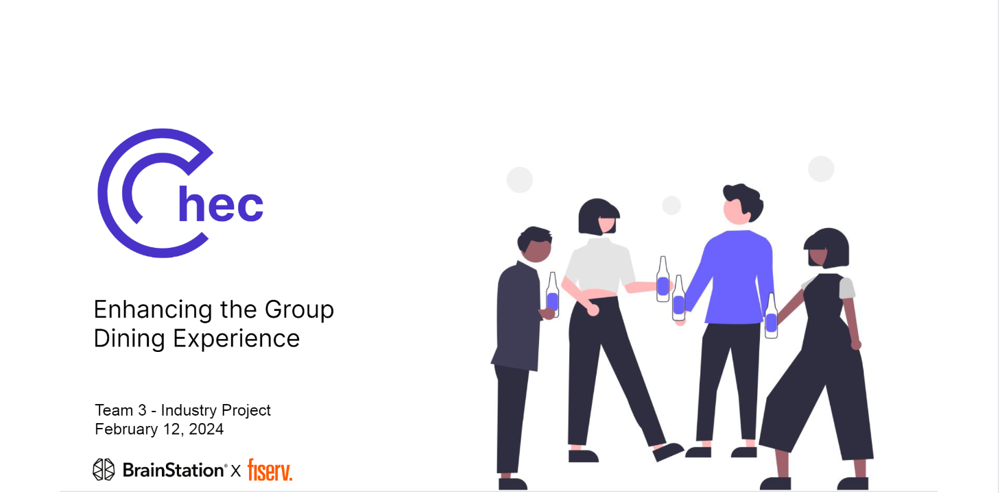

# BrainStation-Industry-Project

Data Scientist | Chec - Enhancing the Group Dining Experience

FEB 2024, INDUSTRY PROJECT  
Analyzed restaurant review data to identify problems and improvement measures. I used Natural Language Processing (NLP) to find keywords for this project and conducted an independent two-sample t-test to assess whether the approach to addressing this problem is precisely correct.

